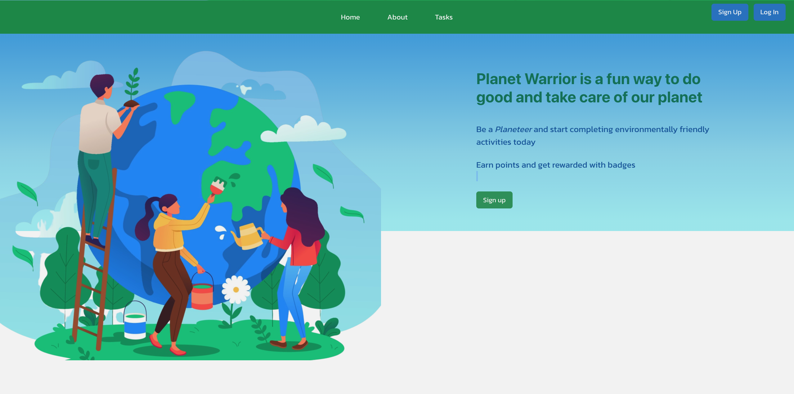

# Planet Warriors App 
🏆  **WINNER** of [**Best Implementation and Potential for Growth**](https://devpost.com/software/planet-warrior) at the HackOR Hackathon March 26-28, 2021. 

## INSPIRATION

We live in a world where human impact is a constant threat to our environment and biodiversity. We see these things being widely ignored across the globe, and this is creating unforeseen impacts on entire ecosystems. However, we don’t have to accept a fate of gloom and doom for the planet. As individuals that are passionate for the environment and have a desire to make a difference, we are taking matters into our own hands by leading the charge in improving the environment through our application, Planet Warrior.

## TOOLS

1. React Hook
2. Ruby
3. Rails API
4. Javascript
5. Google Map Javascript API
6. Chakra UI
7. PostgreSQL
8. Bcrypt + JSON Token
9. Material UI
10. CSS

## WHAT IT DOES

Planet Warrior is a platform that uses creativity to inspire people of all ages to help clean up the planet. Anyone can create an account and start discovering tasks/projects in their immediate area that could benefit the environment, whether picking up trash or planting trees. For each task that is completed, the user receives points that will go towards unlocking badges and leveling up their status with the ultimate goal of gaining the status of Captain Planet. Individuals who achieve this status are recognized for their tremendous impact in saving the planet from pollution.

## WHAT'S NEXT

We plan to build out more features of our application including filters, search bars, progress bars, etc. and ultimately deploy the application to the Web. After doing so, we want to promote our platform to users interested in volunteering, so that we have an active volunteer base that is making a difference in neighborhoods around the world. Lastly, we will pitch our idea to leadership groups/sponsors so that we can expand our network and create a bigger impact.

## PREVIEW

[DEMO](https://planetwarriors.netlify.app/)

### Built by 
* [Winston Chen](https://www.linkedin.com/in/winston-c/)
* [Chi Nguyen](https://www.linkedin.com/in/chi-nguyen-swe/)
* [Mary Ann Navarrete](https://www.linkedin.com/in/maryannnavarrete/)
* [Kirsty Brewster](https://www.linkedin.com/in/kirstybrewster/)
